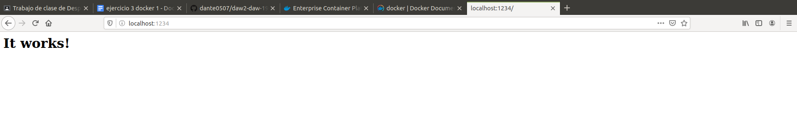

# Realiza las siguientes acciones, documentado cada paso en un archivo md (markdown), incluyendo las instrucciones ejecutadas en la terminal, la salida de las mismas, y la explicación de cada uno de los pasos:

## Ejecuta un contenedor de Apache (httpd) en segundo plano para que se muestre en el puerto 1234 del host

```
docker run -p 1234:80 -d httpd
```



## Accede a la página por defecto de Apache server mediante el navegador (debe mostrar el mensaje It works!)

```
docker run -p 80:80 httpd
```

## Muestra los logs del contenedor en ejecución. En los logs deben aparecer las peticiones GET al servidor y los códigos de respuesta del server.

## Borra todos los contenedores e imágenes de httpd
