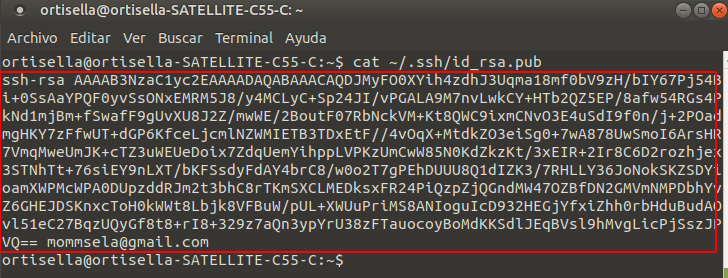
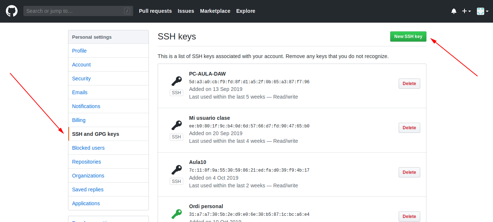
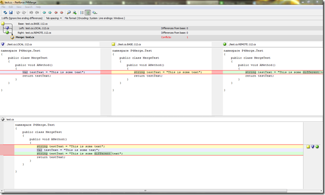
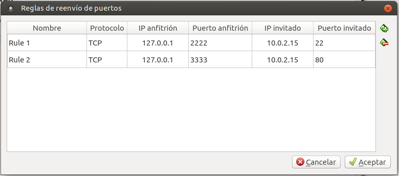
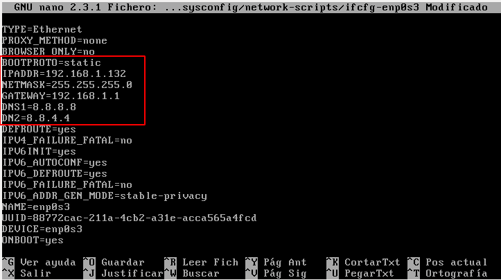
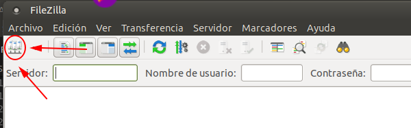
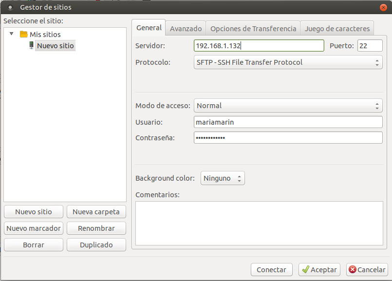
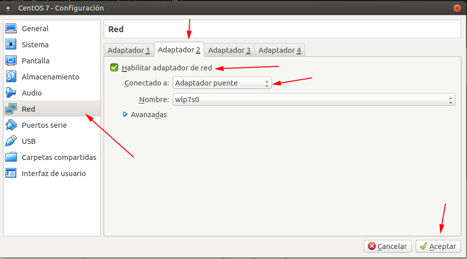

# APUNTES: DESARROLLO DE APLICACIONES WEB


## Índice
- [MARKDOWN CHEATSHEET](#markdown-cheatsheet)
    - [Enlaces internos](#enlaces-internos)
    - [Títulos](#títulos)
    - [Énfasis](#énfasis)
    - [Listados](#listados)
    - [Incluir imágenes](#incluir-imágenes)
    - [Blockquotes](#blockquotes)
    - [Saltos de línea](#saltos-de-línea)

- [FUNCIONAMIENTO DE GIT](#funcionamiento-de-git)
    - [Crear cuenta e instalar GitHub](#crear-cuenta-e-instalar-github)
    - [Clonar repositorio remoto](#clonar-repositorio-remoto)
    - [Instrucciones básicas de GitHub](#instrucciones-básicas-de-github)
    - [Ramas](#ramas)

- [ÁREA DE TRABAJO EN UBUNTU](#área-de-trabajo-en-ubuntu)
    - [Crear usuario](#crear-usuario)
    - [Instrucciones básicas de terminal](#instrucciones-básicas-de-terminal)
    - [Hosts y hostnames](#hosts-y-hostnames)
    - [Instalación de Visual Studio Code](#instalación-de-visual-studio-code)
    - [Instalación de VirtualBox](#instalación-de-virtualbox)

- [CENTOS](#centos)
    - [Instalación en entorno virtualizado](#instalación-en-entorno-virtualizado)
    - [Instrucciones básicas de Apache en CentOS](#instrucciones-basicas-de-apache-en-centos)
    - [Conexión SSH con IPs diferentes](#conexión-ssh-con-ips-diferentes)
    - [Conexión SSH con IPs que coinciden](#conexión-ssh-con-ips-que-coinciden)
    - [Poner la IP estática](#poner-la-ip-estática)
    - [Subir archivos a servidor CentOS](#subir-archivos-a-servidor-centos)
    - [Módulo de Apache para gestionar PHP](#módulo-de-apache-para-gestionar-php)
    - Dominios:
        - [Simular que tenemos varios dominios en el mismo servidor](#simular-que-tenemos-varios-dominios-en-el-mismo-servidor)
        - [Simular que tenemos varios dominios en la misma IP](#simular-que-tenemos-varios-dominios-en-la-misma-ip)
        - [Simular que tenemos varios dominios en varias IP](#simular-que-tenemos-varios-dominios-en-varias-ip)
        - [Simular que tenemos varios dominios en puertos distintos](#simular-que-tenemos-varios-dominios-en-puertos-distintos)
    - [Instalación SQL](#instalación-sql)
    - Seguridad
        - [Autentificación en servidor Apache](#autentificación-en-servidor-apache)
        - [Autentificación con Digest](#autentificación-con-digest)
        - [Control de acceso](#control-de-acceso)
        - [Control de acceso a nivel de carpeta](#control-de-acceso-a-nivel-de-carpeta)
        - [Configuración de SSL](#configuración-de-ssl)
- [UBUNTU SERVER](#ubuntu-server)
    - [Instalación en entorno de virtualización](#instalación-en-entorno-de-virtualización)
    - [Configuración de la IP estática](#configuración-de-la-ip-estática)
    - [Instalación de Apache](#instalación-de-apache)
    - [Creación de páginas web](#creación-de-páginas-web)
    - [Acceder a las webs por IPs distintas](#acceder-a-las-webs-por-ips-distintas)
    - [Acceder a las webs por puertos distintos y misma IP](#acceder-a-las-webs-por-puertos-distintos-y-misma-ip)
    - [Añadir página administración con acceso user/pass](#añadir-página-administración-con-acceso-user/pass)
    - [Carpeta con archivo y activación de indexado](#carpeta-con-archivo-y-activación-de-indexado)
    - [Restringir acceso a carpeta con htaccess](#restringir-acceso-a-carpeta-con-htaccess)
    - [Configuración para acceso sólo por https](#configuración-para-acceso-sólo-por-https)
    - [Instalación de PHP](#instalación-de-php)
    - [Instalación de MariaDB](#instalación-de-mariadb)

    
---
---
## Markdown cheatsheet


### __Títulos__
Se escriben # delante del título. La correspondencia es de: # H1, ## H2, ### H3, #### H4, ##### H5, ###### H6

### __Enlaces internos__
Para poner enlaces como en un índice que referencien secciones del documento se escribe entre [] el nombre del enlace y entre () el nombre de ese enlace sustituyendo los espacios por guiones y con un # delante. Hay que tener cuidado porque los acentos sí se aceptan en (). Luego los títulos se deberán llamar tal cual el enlace. Ejemplo:
```
[Título de la sección](#título-de-la-sección)
```

### __Énfasis__
- Negrita: ```**palabra**``` o ```__palabra__``` : __palabra__ 
- Cursiva: ```*palabra*``` o ```_palabra_``` : *palabra*
- Tachado: ```~~palabra~~``` : ~~palabra~~

### __Listados__
- ```*```, ```-```, ```+``` para listas sin ordenar.
- Números seguidos de un punto para listas ordenadas: ```1.```...  ```2.```...
- Para listados dentro de algún punto se hace con tabulación.  

### __Incluir imágenes__
Para poner imágenes tenemos que poner un ! seguido de [] con el nombre que aparecerá si no puede cargarse la imagen y () la ruta de la imagen:
```

```
### __Blockquotes__
Para escribir texto enmarcado en un cuadro como si fuera una cita textual o algo importante, se escribe el símbolo ```>``` justo delante del texto:
```
>{texto}
```
### __Saltos de línea__
Para que el texto comience un nuevo párrafo se tienen que escribir dos espacios seguidos justo antes de hacer el salto de línea. De forma que: *final de parrafo + espacio + espacio + intro + comienzo del siguiente párrafo*. 

---
---
## Funcionamiento de Git

### __Crear cuenta e instalar GitHub__
Crear una cuenta en GitHub (github.com) con *Sign up* rellenando los campos de nombre de usuario, dirección de correo y contraseña. 

Crear una carpeta mediante el terminal donde clonaremos y pondremos lo del repositorio en el equipo:
```
mkdir {nombre de la carpeta}
```
Instalar git mediante el terminal:
```
sudo apt install git
```
Si aparece un error _"no se pudo bloquear /var/lib/dpkg/lock"_ ..., introducir la siguiente instrucción:
```
sudo fuser -vki /var/lib/dpkg/lock
```
y volver a instalar git:

```
sudo apt install git
```
Para crear o importar un nuevo repositorio tan sólo se tienen que seguir las instrucciones que la página oficial nos indica. 

### __Clonar repositorio remoto__

Cogemos del repositorio la url-clave que aparece tras pulsar el botón *Clone or download*. Tenemos dos opciones, coger la versión SSH o la versión HTTPS. Una vez copiada, escribimos en la terminal de nuestro equipo (El usuario y la contraseña que nos pide, son los de GitHub):
```
git clone {url-clave}
```
A continuación generamos una clave SSH para poder enlazar nuestra cuenta de GitHub a lo que realicemos por terminal. De todo lo que nos pide, sólo introducimos nuestro email, lo demás son todo intros vacias. Para generarla:     
```   
ssh-keygen -t rsa -b 4096 -C {correo con el que ingresas en github}
```
Una vez generada la clave, la mostramos:
```
cat ~/.ssh/id_rsa.pub
```


Luego la copiamos en *Edit user*  >> *Settings*  >> *SSH and PGP keys* de la página GitHub:



Instalamos ahora Openssh-server escribiendo en el terminal:
```
sudo apt install openssh-server
```
Arrancamos el agente SSH en segundo plano: 
```
eval "$(ssh-agent -s)"
```
Añadimos la clave al agente:
```
ssh-add ~/.ssh/id_rsa
```
> ---
>En caso de haber clonado el repositorio mediante HTTPS, hay que cambiar la url-clave del repositorio para que admita git+ssh en vez de https. Para ello vemos cuál es nuestra *url origin*, la url que apunta al repositorio:
>```
>git remote show origin
>```
>De ahi cogemos la dirección y la usamos con:
>```
>git remote set-url origin git+ssh://{dirección url}
>```
> ---

### __Instrucciones básicas de GitHub__
- Ver estado del repositorio local
    ```
    git status
    ```
- Añadir algún archivo modificado o creado al control de versiones:
    ```
    git add {nombre del archivo}
    ```
- Hacer un *commit* (comprometer) los cambios al repositorio local añadiendo una nota que explique lo que hemos hecho:
    ```
    git commit -am "mensaje"
    ```
- Hacer un *commit* que suba todos los cambios al repositorio:
    ```
    git commit -a
    ```
- Subir (*push*) los cambios del repositorio local a la rama principal del repositorio remoto:
    ```
    git push origin master
    ```
- Subir los cambios del repositorio local a la rama que queramos: 
    ```
    git push {nombre de la rama}
    ```
- Actualizar (*pull*) el repositorio local con los cambios desde la rama principal del repositorio remoto:
    ```
    git pull origin master
    ```
- Actualizar el repositorio local con los cambios de la rama que queramos: 
    ```
    git pull {nombre de la rama}
    ```
- Crear un repositorio vacío o reinicializa alguno ya existente para el control de versiones:
    ```
    git init
    ```

### __Ramas__

- Crear una rama:
    ```
    git branch {nombre de la rama}
    ```
- Cambiarse a una rama en concreto:
    ```
    git checkout {nombre de la rama}
    ```
- Crear una rama y cambiarse a ella:
    ```
    git checkout -b {nombre de la rama}
    ```
- Cambiarse a la rama origen o principal:
    ```
    git checkout master
    ```
- Integrar los cambios de una rama específica a la rama en la que estoy:
    ```
    git merge {nombre de la rama específica}
    ```
- Mostrar todas las ramas existentes en el repositorio. De color verde aparece aquella en la que nos encontramos: 
    ```
    git branch
    ```
- Para borrar una rama:
    ```
    git branch -d {nombre de la rama}
    ```
- Ver qué herramientas de ayuda al merge hay:
    ```
    git mergetool
    ```
    >---
    >*Meld* es una de las herramientas para conflictos a la hora de hacer el merge de algún archivo. Se puede instalar escribiendo en el terminal:
    >```
    >sudo apt install meld
    >```
    >
    >
    >Cuando un archivo nos da conflicto nos aparece algo como:   
    > *<<<* HEAD  
    > *Lo que tengo en la rama*  
    > = = = =   
    > *Lo que tengo que decidir si incluir o no porque da conflicto*  
    > *>>>* hotfix  
    >
    >---


---
---
## Área de trabajo en Ubuntu

### __Crear usuario__
Después de la instalación del sistema, en la terminal añadiremos el nombre que tendrá el nuevo usuario personalizado:
```
sudo adduser {nombre del usuario}
```
Ahora necesitamos hacer un superusuario del usuario. Para que se haga efectivo tenemos que cerrar después la sesión:
```
sudo usermod -aG sudo {nombre del usuario}
```

### __Instrucciones básicas de terminal__
- ```ls``` lista el directorio en el que estamos.
- ```ls -l``` lista el directorio en el que estamos pero con más detalle.
- ```ls -al``` lista con detalle todo lo del directorio en el que estamos, incluso lo oculto.
- ```clear``` limpia la vista de la terminal, borra todo lo escrito hasta ahora.
- ```mkdir {nombre de la carpeta}``` crea una carpeta.
- ```cd {nombre de la carpeta}``` para entrar en una carpeta.
- ```cd ..``` para volver a la carpeta anterior en el directorio. 
- ```cd /``` para volver a la carpeta raíz del sistema.
- ```sudo dpkg -i {nombre del archivo a instalar}``` para instalar un archivo ya descargado en el equipo.
- Pulsar *ctrl+c* para parar todo lo que esté ejecutando el terminal. 
- ```unzip {nombre del archivo}``` para descomprimir un archivo por terminal.
- ```cat {nombre del archivo}``` lee por consola el archivo indicado.
- ```nano {nombre del archivo}``` para modificar un archivo por terminal con el editor Nano. El mismo comando sirve para crear un archivo si el nombre que indicamos no existe previamente. 
- ```rm {nombre archivo}``` para borrar un archivo.

### __Hosts y hostnames__
Para sacar el nombre del servidor: 
```
cat /etc/hostname
```
Si queremos cambiar el nombre del servidor o añadir uno nuevo:
```
sudo nano /etc/hostname
```
Para ver mis hosts:
```
cat /etc/hosts
```
Para cambiar un host a un nombre más recordable (se pueden tener tantos como se quiera):
```
sudo nano /etc/hosts
```

### __Instalación de Visual Studio Code__
En el terminal tenemos que actualizar dependencias con: 
 ```
 sudo apt update
 ```
 Luego instalamos la última versión disponible para nuestro sistema escribiendo en el terminal:
 ```
 sudo apt install code
 ```
 Si lo queremos actualizar a una última versión disponible tendremos que escribir en terminal los siguientes comandos:
 ```
 sudo apt update
 sudo apt upgrade
 ```

### __Instalación de Flameshot__
Para instalar el programa con el que poder hacer capturas de pantalla en Ubuntu tendremos que escribir en el terminal:
```
sudo apt install flameshot
```

 ### __Instalación de VirtualBox__
Primero vamos a necesitar instalar las dependencias para que no dé un fallo la instalación: 
```
sudo apt install libcurl4 libqt5opengl5 libqt5printsupport5
```
Descargamos VirtualBox y el *extension pack* desde la página oficial de descargas https://www.virtualbox.org/wiki/Linux_Downloads y ejecutamos el archivo .deb descargado:
```
sudo dpkg -i {archivo .deb}
```

---
---
## CentOS

### __Instalación en entorno virtualizado__
Descargamos la iso de la última versión *minimal* de https://mirror.umd.edu/centos/7/isos/x86_64/ y la instalamos en VirtualBox. Cuando se nos pida crear un usuario, lo hacemos administrador. 

A partir de aquí, dejaremos la terminal de nuestro equipo y usaremos la de CentOS. 

Hay que recordar que CentOs no se conecta a la red una vez instalado, por lo que habrá que cambiar el archivo *ifcfg-enpOs3*. Para ello, escribimos en el terminal:
```
sudo vi /etc/sysconfig/network-scripts/ifcfg-enp{y pulsamos el tabulador para que termine el nombre del archivo correspondiente en nuestro equipo}
```
En *ONBOOT* pone *no*, tenemos que cambiarlo a *yes*, situando el cursor en el lugar a escribir y tecleando una ```i``` para entrar en el modo edición. Para guardar y salir tenemos que escribir ```:wq```. 

Acto seguido, necesitamos reiniciar el servicio de red escribiendo en el terminal:
```
sudo service network restart
```

Para instalar Apache escribimos en el terminal (y contestamos que sí a todas las preguntas):
```
sudo yum install httpd
```

Para ver si está instalado: 
```
systemctl status httpd
```

Ahora tenemos que arrancar el servidor:
```
sudo systemctl start httpd
```
Para que el servidor arranque automáticamente al inicio (no hace falta que cuando escribamos la instrucción esté en marcha): 
```
sudo systemctl enable httpd
```

### __Instrucciones básicas de Apache en CentOS__
- Podemos ver qué distribución estamos usando remotamente con: ```cat /etc/*-release```
- Y para ver la versión de Apache (v saca información pero V saca muchos más datos): ```httpd -v```
- El estado de Apache lo obtenemos escribiendo: ```apachectl status```
- Para parar el servidor: ```sudo apachectl stop```
- Para reiniciar el servidor parando todas las tareas que se están realizando por atrás: ```sudo apachectl restart```
- Para reiniciar el servidor esperando a que acaben las tareas todavía no terminadas: ```sudo apachectl graceful```
- Instalar manual de Apache para poder consultarlo: 
    >```sudo yum install httpd-manual```  
    Reiniciamos el servidor con ```apachectl restart```  
    y accedemos a él escribiendo en la url de algún navegador web ```{IP}:{puerto}/manual/```
- Instalación del servidor de SSH: ```sudo yum install openssh-server```
- Reiniciar CentOS: ```sudo shutdown -rf now```
- Apagar CentOS: ```sudo shutdown now```
- Reiniciar la máquina virtual: ```sudo reboot```
- Para ver los archivos de Apache:
    >```cd /etc/httpd```  
    ```ll```   
    Allí vemos que:  
    >- En *conf* esta el archivo de configuración de apache
    >- En *conf.d* podemos crear archivos de configuración parciales
    >- En *conf modules.d* está la configuración de los módulos
    >- En *logs* encontramos las respuestas del servidor
    >- En *modules* podemos acceder a los módulos  
    >- Si cambiamos algo del archivo de configuración y da errores, podemos comprobarlo con: ```sudo apachectl configtest```

- Para salir del terminal del servidor y volver al terminal del equipo cuando los tenemos enlazados: ```exit```

### __Conexión SSH con IPs diferentes__
Para poder conectarnos por SSH necesitamos saber la IP tanto de la máquina virtual como de nuestro equipo, para ello podemos escribir en ambas terminales: 
```
ip addr show
```
Ahora entramos a la *Configuración* de CentOS en VirtualBox y en el apartado de *Red*, asegurándonos de que estamos conectados mediante NAT. 

Para conectar ambos sistemas por SSH debemos tenerlos en la misma IP, eso lo conseguimos entrando en la configuración de Red, en *Avanzadas* y *Reenvío de puertos*. Creamos nuevas reglas uniendo las IP anfitrión e invitado por los mismos puertos:  

  

En la terminal del equipo ahora podemos usar la terminal de CentOS indicando el puente:
```
ssh {usuario de centos}@{IP anfitrión} -p {puerto anfitrión}
```
Si hemos tenido algún problema para conectar por SSH, necesitamos abrir el firewall en la máquina virtual:
```
sudo firewall-cmd --zone=public --add-service=http --permanent  

sudo firewall-cmd --zone=public --add-service=ssh --permanent
```
Y reiniciamos el firewall:
```
sudo firewall-cmd --reload
```

### __Conexión SSH con IPs que coinciden__
En este caso, para usar la conexión SSH debemos estar en la misma IP tanto en máquina virtual como en nuestro equipo. 

Tenemos que cambiar la interfaz de red (*Configuración* de VirtualBox + *Red*) de NAT a BRIDGE o Adaptador Puente. 

Podemos ver ambas IPs en los dos terminales con:
```
ip addr show
```
Cuando ambas IPs coinciden, podemos usar el terminal de CentOS en el de nuestro equipo escribiendo:
```
ssh {nombre de usuario de CentOS}@{IP}
```
Necesitamos también habilitar el puerto 80 para el servidor:
```
sudo firewall-cmd --zone=public --add-service=http --permanent 

sudo firewall-cmd --zone=public --add-service=ssh --permanent
```
Debemos reiniciar el firewall:
```
sudo firewall-cmd --reload
```

### __Poner la IP estática__
Desde el terminal del servidor entramos al archivo *ifcfg-enpOs3* para editarlo con ```i``` y guardando con ```:wq```. Cambiamos *BOOTPROTO* y añadimos las líneas de *IPADDR* con la IP actual, *NETMASK* con lo que hay atrás de la / en la IP (24 = 255.255.255.0),*GATEWAY* , *DNS1* y *DNS2*:




### __Subir archivos a servidor CentOS__
Para ver una interfaz con lo que tenemos en el servidor, necesitaremos instalar Filezilla en la terminal de nuestro equipo. Se trata de un programa para conectarse por remoto al servidor:
```
sudo apt install filezilla
```
En el *Gestor de archivos* creamos un *Nuevo sitio* poniendo nuestra IP, el puerto 22, protocolo SFTP, modo de acceso normal, usuario y contraseña: 




Si en el terminal del servidor creamos una carpeta (```mkdir {nombre carpeta}```), en Filezilla veremos que aparece en la parte del servidor. Para pasar archivos del equipo al servidor, tan sólo tenemos que arrastrarlos desde la parte izquierda que representa nuestro equipo, a la derecha que representa el servidor. 

### __Módulo de Apache para gestionar PHP__
En la terminal del servidor, podemos ver cuáles son los módulos que tenemos instalados:
```
http -m
```
Añadimos el repositorio donde se actualiza todo lo referente a php:
```
sudo yum install epel-release yum-utils
```
Es necesario reiniciar la red:
```
sudo service network restart
```
Ahora ya podemos instalar PHP y el resto de librerías relacionadas que necesitamos: 
```
sudo yum install http://rpms.remirepo.net/enterprise/remi-release-7.com  

sudo yum-config-manager --enable remi=php72

sudo yum install php php-common php-opcache php-mcrypt
php-cli

sudo yum install php-gd php-curl php-mysqlnd
```

Para la versión instalada de PHP:
```
php -v
```

En la configuración de los módulos ahora vemosque hay un archivo php porque ya está instalado:
```
ll /etc/httpd/conf.modules.d
```
Para añadir una página PHP al servidor, creamos el archivo y entramos en modo edición para redactarlo:
```
sudo nano /var/www/index.php
```
Si da problemas como en clase, tendremos que poner la página dentro de alguna carpeta que tengamos en el servidor como /var/www/clientes/index.php.  
Reiniciamos el servidor
```
sudo apachectl restart
```
Podremos ver la página en el navegador escribiendo en la barra de direcciones {IP del servidor}/index.php

### __Simular que tenemos varios dominios en el mismo servidor__
En Filezilla, conectamos con el servidor y copiamos la web comprimida de local al servidor mediante el terminal y la carpeta donde está la web en local:
```
scp ./{archivo .zip donde tenemos toda la web} {usuario de CentOS}@{IP} {ruta donde queremos poner la web en el servidor}/{archivo .zip donde tenemos toda la web}
```
>Si el servidor no conecta en Filezilla, dentro de *Edición* + *Opciones* + *Aumentar el tiempo de espera* y añadimos más segundos. 

Ya en la terminal de CentOS podemos ver las carpetas del servidor y sus permisos que tienen los archivos de la web, los cuales tendrían que ser 644 (rw-r--r--) para archivos y 755 (rwxr-xr-r) para carpetas:
```
ll /var/www
```

Allí dentro podemos crear las carpetas para las webs que queramos. Por ejemplo: 
```
sudo mkdir /var/www/clientes

sudo mkdir /var/www/proveedores
```
Desde el terminal en local pasamos todos los archivos alojados en local al servidor para cada una de las webs:
```
sudo cp -R {nombre carpeta de la web en local}/* /var/www/{nombre carpeta del servidor que la alojará}
```
Ahora, desde el terminal del servidor, podemos modificar los archivos que contienen para cada una de las webs:
```
sudo nano /var/www/{carpeta que contiene la web en servidor}/index.html
```
Cuando vayamos a ver cualquiera de las webs en el navegador, las veremos indicando la dirección IP y la carpeta que la aloja en la url del navegador. 

### __Simular que tenemos varios dominios en la misma IP__
Debemos crear hosts virtuales dentro del directorio de configuración:
```
sudo nano /etc/httpd/conf.d/{archivo de configuración de la carpeta.. por ejemplo: clientes.conf}
```
Allí dentro escribimos para que reciba peticiones de cualquier IP al puerto 80, la ruta donde se encuentra y el dominio en el que irá:
```
<VirtualHost *:80>
{4 espacios} DocumentRoot /var/www/clientes
{4 espacios} ServerName clientes.com
</VirtualHost>
```
Como los dos dominios pertenecen a la misma IP en el terminal local editamos el archivo *hosts* (```sudo nano /etc/hosts```) y ponemos la IP del dominio simulando que lo hemos comprado. Ejemplo: 
```
192.168.1.178 clientes.com
```
Después tendremos que reiniciar Apache desde el terminal de CentOS:
```
sudo apachectl restart
```
Si entramos en *clientes.com* mediante el navegador, veremos nuestra web para clientes.. y lo mismo para el resto de webs alojadas en el servidor con la misma IP. 

### __Simular que tenemos varios dominios en varias IP__
Con el servidor apagado (lo apagamos con ```sudo shutdown now```), en VirtualBox creamos otro adaptador en *Configuración* + *Red* + *Adaptador 2* + *Adaptador puente*: 



Volvemos a encender el servidor y vemos con ```ip addr show``` que el servidor tiene dos IPs.  

Tenemos que modificar el archivo de configuración de uno de los dominios para ponerle un host virtual diferente, para que no tenga el mismo que ningún otro de los dominios de nuestro servidor:
```
<VirtualHost {IP distinta}:80>
{4 espacios} DocumentRoot /var/www/clientes
{4 espacios} ServerName clientes.com
</VirtualHost>
```
Reiniciamos el servidor (```sudo apache restart```) y con el terminal local eidtamos los hosts (```sudo nano /etc/hosts```) y cambiaos las IPs para cada dominio como corresponde, para que nos salgan bien en la barra del navegador, si no irá a la misma web porque dirige a la página *index.html* que tiene el servidor. 

### __Simular que tenemos varios dominios en puertos distintos__
Cambiamos el archivo de configuración del dominio para que el VirtualHost tenga un puerto diferente, y en la primera línea tenemos que forzar la escucha: 
```
Listen {nuevo puerto}
<VirtualHost {IP}:{nuevo puerto}>
{4 espacios} DocumentRoot /var/www/clientes
{4 espacios} ServerName clientes.com
</VirtualHost>
```
Necesitamos reiniciar el servidor para que se haga efectivo: 
```
sudo apachectl restart
```
Ahora es necesario abrir el puerto en el firewall: 
```
sudo firewall-cmd --add-port={nuevo puerto que hemos escrito antes en VirtualHost}/tcp --permanent
```
Relanzamos el firewall:
```
sudo firewall-cmd --reload
```

### __Instalación SQL__

Primero debemos instalar todas las dependencias para los paquetes de SQL Server:
```
sudo yum install mariadb mariadb-server
```
Podemos ver cuál es el estado de nuestras bases de datos en el servidor con:
```
sudo systemctl status mariadb
```


Ahora ponemos la bbdd en marcha:
```
sudo systemctl start mariadb
```
y habilitamos el servicio:
```
sudo systemctl enable mariadb
```
Configuramos la seguridad de la base de datos (pulsamos a todo que sí y la contraseña la dejamos vacía con intro o escribimos la nuestra si le habíamos puesto una). Decimos que sí para borrar todo lo que se crea predefinido. 
```
sudo mysql_secure_installation
```
Para probar si funciona, entramos en el gestor de bbdd y para salir escribimos "quit".
```
mysql -u root -p
```
Podemos ver las bases de datos que tenemos con:
```
show DATABASES
```
Pero para crear una bbdd escribimos:
```
create DATABASE {nombre de la bbdd};
```
Ahora necesitamos instalar PhpMyAdmin y sus dependencias:
```
sudo yum install php-pecl-zip php-mbstring

sudo yum install phpmyadmin
```
Tenemos que editar el archivo de configuración para añadir las conexiones de seguridad.
```
sudo nano /etc/httpd/conf.d/phpMyAdmin.conf
```
Comentamos todo lo que hay en < RequireAny >, etiquetas incluídas, escribiendo # al comienzo de cada línea, y añadimos inmediatamente después __Require all granted__


Necesitamos reiniciar el servidor:
```
sudo apachectl restart
```
Podemos ver el resultado en el navegador, escribiendo en la barra de direcciones {Ip del servidor}/phpmyadmin/

### __Autentificación en servidor Apache__

Crearemos una página a la que sólo pueda acceder el Administrador. Para ello, primero creamos la página:
```
sudo mkdir /var/www/clientes/admin

sudo nano /var/www/clientes/admin/index.html
```
Dentro podemos escribir algo como _Página restringida a admins_  
Podremos ver la página en el navegador escribiendo en la barra de direcciones {IP del servidor}/admin  

Ahora necesitamos crear una carpeta para guardar las contraseñas: 
```
sudo mkdir /etc/httpd/password
```
y dentro creamos un archivo para las contraseñas añadiendo al usuario:
```
sudo htpasswd -c /etc/httpd/password/{archivo de contraseñas, ej: passwords-admin} {usuario, ej: admin}
```
Pedirá la contraseña para ese usuario y ponemos admin para que sea más fácil de recordar. 

Podemos ver los usuarios y sus contraseñas encriptadas en: 
```
cat /etc/httpd/{carpeta, ej: password}/{archivo, ej: passwords-admin}
```

Ahora debemos restringir el acceso a la página de administradores: 
```
sudo nano /etc/httpd/conf.d/clientes.conf
```
Añadimos al final del archivo: 
```
<Directory "/var/www/clientes/admin"> {es el directorio al que quiero poner las restricciones}
    AuthBasic
    AuthName "Administrador"
    AuthUserFile /etc/httpd/password/passwords-admin
    Require valid-user {si solo quisieramos que entrara el usuario admin, pondríamos Require user admin}
</Directory>
```
  

Comprobamos que no hay ningún error en la configuración con:
```
sudo apachectl configtest
```
y reiniciamos el servidor:
```
sudo apachectl restart
```
Si en la barra de direcciones del navegador escribimos {IP del servidor}/admin/ nos pedirá el usuario y la contraseña para poder acceder. 

### __Autentificación con Digest__

La autentificación básica envía la información en texto plano, mientras que la Digest la manda encriptada. Sin embargo, la básica se guarda encriptada en el servidor y la Digest no. 

Creamos un archivo al que más adelante restringiremos el acceso: 
```
sudo mkdir /var/www/proveedores/admin

sudo nano /var/www/proveedores/admin/index.html
```
Ahora creo un usuario con contraseña (para añadir simplemente usuarios sin crearlos es quitando -c):
```
sudo htdigest -c /etc/httpd/password/digest "{nombre del grupo, ej: administradores}" {nombre del usuario, ej: admin}
```
Para ver el archivo con los usuarios y las contraseñas: 
```
cat /etc/httpd/password/digest
```
El acceso se configura de forma muy similar a la forma básica. 
```
sudo nano /etc/httpd/conf.d/proveedores.conf
```
Añadimos al final del archivo: 
```
<Directory "/var/www/proveedores/admin"> {es el directorio al que quiero poner las restricciones}
    AuthDigest
    AuthName "Administradores" {Tiene que coincidir con el que hemos puesto en el grupo al crear el usuario}
    AuthUserFile /etc/httpd/password/passwords-admin
    Require valid-user {si solo quisieramos que entrara el usuario admin, pondríamos Require user admin}
</Directory>
```
  

Comprobamos que no hay ningún error en la configuración con:
```
sudo apachectl configtest
```
Si pasa el configtest pero aún así no nos funciona, podemos mirar los logs y encontrar lo que nos acaba de pasar al final de la ventana: 
```
sudo more /var/log/httpd/error_log
```
Reiniciamos el servidor:
```
sudo apachectl restart
```
Si en la barra de direcciones del navegador escribimos {IP del servidor}/admin/ nos pedirá el usuario y la contraseña para poder acceder. 

### __Control de acceso__

Podemos restringir el acceso a una página mediante una IP. Para ello, primero deberemos crear la página:
```
sudo mkdir /var/www/clientes/gestion

sudo nano /var/www/clientes/gestion/index.html

y escribimos dentro Web restringida al departamento de gestión
```
Modificamos el archivo de configuración donde está alojada la página:
```
sudo nano /etc/httpd/conf.d/clientes.conf
```
Añadimos en ese archivo un nuevo Directory:
```
<Directory "/var/www/clientes/gestion">
    <RequireAll>
        Require all denied {se deniega el acceso a todo el mundo}
        Require ip {nuestra ip} {para que solo pueda acceder la ip indicada}
        Require not ip {ip que queremos excluir}
    </RequireAll>
</Directory>
```
> Para poner todas las IP del centro de estudios:  
> Require ip 192.168.1.0/255.255.255.0   
> ó 192.168.1.0/24  
> ó 192.168.1

Tenemos que comprobar que el archivo de configuración no tiene ningún error: 
```
sudo apachectl configtest
```
Y reiniciamos el servidor:
```
sudo apachectl restart
```

### __Control de acceso a nivel de carpeta__

Con __.htaccess__. Permite configurar el acceso en tiempo real sin tener que reiniciar el servidor. El proceso busca el archivo cada vez, lo cual cuesta tiempo y rendimiento. 

Creamos una carpeta para restringir su acceso más adelante:
```
sudo mkdir /var/www/clientes/testhtaccess
```
Y un archivo con el mensaje "Probando restricción de acceso mediantes .htaccess":
```
sudo nano /var/www/clientes/testhtaccess/datos.txt

Tiene que ser datos.txt porque con un archivo index.html no funciona
```
Modificamos el archivo de configuración donde está alojada la página:
```
sudo nano /etc/httpd/conf.d/clientes.conf
```
Añadimos en ese archivo un nuevo Directory:
```
<Directory "/var/www/clientes/testhaccess">
    AllowOverride all
    Options Indexes
</Directory>
```
  

Tenemos que comprobar que el archivo de configuración no tiene ningún error: 
```
sudo apachectl configtest
```
Y reiniciamos el servidor:
```
sudo apachectl restart
```
Para poner quién va a poder ver lo que haya en la carpeta y quién no entramos en
```
sudo nano /var/www/clientes/testhaccess/.htaccess
```
y escribimos dentro:
```
<Directory "/var/www/clientes/gestion">
    <RequireAll>
        Require all denied {se deniega el acceso a todo el mundo}
        Require ip {nuestra ip} {para que solo pueda acceder la ip indicada}
        Require not ip {ip que queremos excluir}
    </RequireAll>
</Directory>
```


### __Configuración de SSL__

Para hacer la conexión segura (que el servidor al que nos conectamos sea el que dice ser) y que el tráfico esté encriptado. 

Usaremos una entidad certificadora que nos de un certificado autofirmado. Para ello, instalamos el servidor de SSL:
```
sudo yum install openssl
```
Creamos una clave privada:
```
openssl genrsa -out {nombre del certificado, ej: certificado.key} {fuerza, ej: 2048}
```
Creamos el csr, la clave privada:
```
openssl req -new -key certificado.key -out certificado.csr

Para el código de país escribimos ES y vamos rellenando los datos
```
Generamos un crt:
```
openssl x509 -req {caducidad, ej: -days 90} -in certificado.csr -signkey

openssl x509 -req {caducidad, ej: -days 90} -in certificado.crt -signkey

openssl x509 -req {caducidad, ej: -days 90} -in certificado.key -out -signkey
```
Con ```ll``` podemos ver todos los certificados que ya tenemos. 

Necesitamos agregar el certificado al servidor para que haga la comprobación con cada conexión. Para ello, instalamos el módulo de Apache que gestiona las conexiones seguras:
```
sudo yum install mod_ssl

Indicamos que sí a todo. 
Se instala en ll /etc/httpd/conf.d
```
Copiamos los certificados:
```
sudo cp certificado.crt /etc/pki/tls/certs

sudo cp certificado.key /etc/pki/tls/private
```
Configuramos el archivo SSL para que seapa dónde están los certificados: 
```
sudo nano /etc/httpd/conf.d/ssl.conf
```

Las líneas que comiencen por __sslcertificatefile__ las cambiamos para que donde pone _localhost_ ponga el nombre de nuestro certificado. Guardamos y reiniciamos Apache:
```
sudo apachectl restart
```
Cuando vamos a comprobar el acceso mediante el navegador escribiendo en la barra de direcciones ```https://clientes.com``` no nos deja verlo por el puerto, por lo que tendremos que abrir el 443:
```
sudo firewall-cmd --zone=public --add-service=https --permanent

sudo firewall-cmd --reload
```
Ahora debería salirnos en el navegador una ventana de advertencia. Aceptamos el riesgo y continuamos. Esto ocurre porque el certificado es autofirmado. 

Para que se nos lleve directamente a una conexión segura tenemos que modificar VirtualHost:
```
sudo nano /etc/httpd/conf.d/clientes.conf
```
Dentro de < VirtualHost > añadimos:
```
Redirect / https://clientes.com
```


Guardamos y reiniciamos el servidor:
```
sudo apachectl restart
```

## Ubuntu Server

### Instalación en entorno de virtualización

Bajamos Ubuntu Server 18.04 en su versión minimal. En la instalación, marcamos instalar OpenSSH Server sin poner ningún paquete. En VirtualBox, cambiamos la configuración de red (Configuración >> Red) de NAT a _adaptador puente_ y entonces el servidor nos generará una IP válida. 

Para entrar en Ubuntu server desde la terminal de Linux escribimos: 
```
sudo  ssh {nombre del usuario en ubuntu server}@{IP del servidor}
```

### Configuración de IP estática

Para ver la IP escribimos:
```
ip addr show
```

Para ver la configuración: 
```
ll /etc/netplan/
```

Entramos en:
```
sudo nano /etc/netplan/50-cloud-init.yaml
```
y cambiamos:
>comentamos dhcp4: true  
>añadimos después:  
>addresses: [192.168.1.173/24] {nuestra IP}
>gateway4: 192.168.1.2
>dhcp4: no
>nameservers:  
>{identado} addresses: [8.8.8.8, 8.8.4.4]  
>optional: true  

Guardamos y reiniciamos la red con la nueva configuración:
```
sudo netplan apply
```
En la terminal local entramos en hosts y añadimos nuestra IP y le damos un nombre: 
```
sudo nano /etc/hosts
_________
192.168.1.173 ubuntu-server
```
Ahora podremos entrar en el servidor con {nombre de usuario en el servidor}@ubuntu-server

Para ver el estado del firewall escribimos:
```
sudo ufw status
```

Activamos el firewall:
```
sudo ufw enable 
```
y pulsamos que sí. 

Para ver más información escribimos:
```
sudo status verbose
```

Para ver un lista de las aplicaciones o módulos permitidas en el firewall:
```
sudo ufw app list
```

### Instalación de Apache

Para instalar Apache: 
```
sudo apt install apache2
```

Para ver el estado de Apache, viendo que se habilita y se pone en marcha automáticamente: 
```
systemctl apache2 status
```

Si tuvieramos que habilitarlo manualmente es igual que CentOS:
```
sudo apachectl stop
ó
sudo apachectl start
```

Ahora tenemos que abrir el puerto en el firewall:
```
sudo ufw allow 'Apache'
```
Si ahora volvemos a hacer un ```sudo ufw status``` que ya está permitido.

Ahora, en el navegador ponemos la IP y nos sale la página de inicio de Apache.

Para ver las características del servidor:
```
cat /etc/* -release
```

Para instalar el manual y verlo después en el navegador escribiendo en él {ip}/manual:
```
sudo apt install apache2-doc
```

Vemos los permisos de los archivos en: 
```
ll /etc/apt
```

Para ver todos los archivos que hay en Apache:
```
ll /etc/apache2
```
El archivo principal de configuración es ```apache2.conf```. Aquí también podemos encontrar parejas de directorios. En ```available``` están las configuraciones que creamos. En ```enabled``` están los archivos activos que sirve el servidor. 

Para ver las páginas que tiene el servidor:
```
ll /var/www
```

### Creación de páginas web

En Filezilla creamos un nuevo sitio con ```nuestra IP```, ```puerto 22```, ```SFTP``` y ```acceso normal```. Si no va, al firewall le añadimos OpenSSH abriendo el puerto 22 con:
```
sudo ufw allow 'OpenSSH' 
```

Instalamos unzip: ```sudo apt install unzip```

Pasamos los archivos y creamos dentro la web, por ejemplo, "alumnos": 
```
{dentro de web-daw en la terminal del servidor}
sudo mkdir /var/www/alumnos
```
Copiamos los archivos de la carpeta donde estoy a alumnos:
```
sudo cp -R . /var/www/alumnos/
```
Editamos la web y guardamos:
```
sudo nano /var/www/alumnos/index.html
```

Añadimos en el archivo de configuración:
```
sudo nano /etc/apache2/sites-available/alumnos.conf
```
><VirtualHost *:80>  
>{4 espacios}ServerName alumnos.com  
>{4 espacios}DocumentRoot /var/www/alumnos
></VirtualHost>

Activamos la página en la carpeta enable:
```
sudo a2ensite alumnos
systemctl reload apache2
```

Abrimos terminal en local y añadimos el dominio a la IP:
```
sudo nano /etc/hosts
______________
{ip} alumnos.com
```

Reiniciamos Apache:
```
sudo systemctl reload apache2
```

Ahora podemos ver la web escribiendo en el navegador ```alumnos.com```. Si tenemos problemas limpiamos la cache de firefox con ```ctrl+F5```.

Para deshabilitar el sitio y quitarlo de la carpeta sites-enabled:
```
sudo a2dissite alumnos
```

### Acceder a las webs por IPs distintas

Configuramos la IP estática como hecho en el apartado anterior. Comentamos lo de después del true y añadimos:
>enpOS8:
>{4 espacios}dhcp4:true
>{antes de version: 2}
y reiniciamos la red ```sudo systemctl reload apache2```

Vemos la segunda IP con ```ip addr show``` 

Entramos al archivo de configuración de profesores y en el virtualhost ponemos la IP: 80
```
sudo nano /etc/apache2/sites-available/profesores.conf
```
Activamos la página en la carpeta _enable_:
```
sudo a2ensite profesores
systemctl reload apache2
```

### Acceder a las webs por puertos distintos y misma IP

En el archivo de configuración de profesores volvemos a poner nuestra IP y un puerto nuevo: 
```
sudo nano /etc/apache2/sites-available/profesores.conf
```
>Listen 8008  
><VirtualHost 192.168.1.186: 8008>  
>...

Activamos la página en la carpeta _enable_:
```
sudo a2ensite profesores
systemctl reload apache2
```

Abrimos el puerto en el firewall: 
```
sudo ufw allow 8008
```

### Añadir página administración con acceso user/pass

Se hace mediante la configuración básica. 

Se crea un dominio como en el apartado [Creación de páginas web](#creación-de-páginas-web):
```
sudo mkdir /var/www/profesores/admin
sudo nano /var/www/profesores/admin/index.html
```
y dentro escribimos "Página restringida a admins". Recargamos con:
``` 
systemctl reload apache2
```
Creamos una carpeta para guardar contraseñas: 
```
sudo mkdir /etc/apache2/password
```
y dentro creamos un archivo para las contraseñas:
```
sudo htpasswd -c /etc/apache2/password/passwords-admin admin
```
Pedirá contraseña para ese usuario y ponemos ```admin```.

Restringimos el acceso a la página administradores:
```
sudo nano /etc/apache2/sites-available/profesores.conf
```
><Directory "/var/www/profeores/admin">  
>{4 espacios}AuthType Basic  
>{4 espacios}AuthName "Administrador"  
>{4 espacios}AuthUserFile /etc/apache2/password/passwords-admin  
>{4 espacios}Require valid-user  {o Require user admin}  
>< /Directory> {sin el espacio}

Para ver que lo he escrito todo bien en el documento:
```
sudo apachectl configtest
```
Y reiniciamos Apache con:
```
sudo apachectl restart apache2
```

### Carpeta con archivo y activación de indexado

Creamos la carpeta y el archivo: 
```
sudo mkdir /var/www/profesores/secret-files
sudo nano /var/www/profesores/secret-files/secret-text.txt
```
Activamos el indexado con el archivo de configuración de profesores: 
```
sudo nano /etc/apache2/sites-available/profesores.conf
```
y añadimos el directorio:
><Directory "/var/www/profesores/secret-files">  
>{4 espacios}AllowOverride all  
>{4 espacios}Options Indexes  
>< /Directory>  {sin el espacio}

Comprobamos que funciona accediendo en el navegador a profesores.com/secret-files y vemos el directorio

### Restringir acceso a carpeta con htaccess

Para restringir que se vea lo que hay en la carpeta:
```
sudo nano /var/www/profesores/secret-files/.htaccess
```
y escribimos dentro ```Require all denied``` sin poner nada más. 

Comprobamos que funciona poniendo en el navegador profesores.com/secret-files y aparece el __error 403__.

### Configuración para acceso sólo por https

Se trata de usar la configuración de SSL. En Ubuntu Server no es necesario instalar el módulo SSL porque viene instalado por defecto con Apache, pero hay que activarlo: 
```
sudo a2enmod ssl
```
y reiniciamos Apache con:
```
systemctl restart apache2
```
No es necesario instalar OpenSSL, pero si no lo estuviera, se instala con: 
```
sudo apt install openssl
```
La ruta de los certificados en Ubuntu Server es ```/etc/ssl/```

Generamos una clave privada: 
```
openssl genrsa -out certificado.key 2048
{certificado es el nombre para el archivo}
{2048 es la fuerza de la protección}
```
Creamos el archivo __csr__, la clave privada: 
```
openssl req -new -key certificado.key -out certificado.csr
{En el código del país escribimos ES y vamos rellenando}
```
Creamos un __crt__:
```
openssl x509 -req -days 90 -in certificado.csr -signkey certificado.key -out certificado.crt
```
Con ```ll``` vemos todos los certificados que tenemos.

Ahora copiamos los certificados:
```
sudo cp certificado.crt /etc/ssl/certs
sudo cp certificado.key /etc/ssl/private
```

En el archivo de configuración de profesores: 
```
sudo nano /etc/apache2/sites-available/profesores.conf
```
><VirtualHost *:443>  
>{4 espacios}ServerName profesores.com  
>{4 espacios}DocumentRoot /var/www/profesores  
>{4 espacios}SSLEngine On  
>{4 espacios}SSLCertificateFile /etc/ssl/certs/certificado.crt  
>{4 espacios}SSLCertificateKeyFile /etc/ssl/private/certificado.key  
>< /VirtualHost>   {sin el espacio}

Para redirect, añadimos en el virtualhost: 
>{4 espacios}Redirect permanent /https://profesores.com

Configuramos el archivo ssl para que sepa dónde están los certificados:
```
sudo nano /etc/apache2/sites-available/default-ssl.conf
```
Cambiamos la ruta del SSLCertificateFile a la ruta del crt y SSLCertificateKeyFile a la ruta del key. Guardamos y reiniciamos apache con:
```
systemctl restart apache2
```

Abrimos el puerto 443 con:
```
sudo ufw enable
```
Activamos Apache Full para activar el https:
```
sudo ufw allow 'Apache Full'
```
Si no conecta con el servidor, ponemos nuestra IP para el dominio que toca en ```sudo nano /etc/hosts```.

### Instalación de PHP

Instalamos con:
```
sudo apt install php libapache2-mod-php php-mysql
```

Para ver la versión de PHP instalada: ```php-v```
Añadimos una página de php:
```
suudo nano /var/www/html/index.php
```
Dentro escribiremos ```<?php phpinfo(); ?>```
y reiniciamos el servidor con ```sudo systemctl restart apache2```

Lo comprobamos en el navegador con {ip del servidor}/index.php

### Instalación de MariaDB

Se instala con:
```
sudo apt install mariadb-server
```
Damos a todo que sí, la contraseña que pide al principio es vacía pero luego sí escribimos una... al configurar la seguridad con:
```
sudo mysql_secure_installation
```

Para comprobar las bases de datos existentes
```
sudo mysql -u root -p
show DATABASES;
{para salir escribimos quit}
```

Instalamos phpmyadmin:
```
sudo apt install phpmyadmin
```
Le damos a configuración de apache2 y que NO queremos configurar mannualmente. 

```
sudo ln -s /etc/phpmyadmin/apache.conf /etc/apache2/conf-available/phpmyadmin.conf

sudo ln -s /etc/apache2/conf-available/phpmyadmin.conf /etc/apache2/conf-enabled/phpmyadmin.conf

sudo apachectl restart
```


---
---