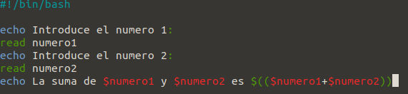
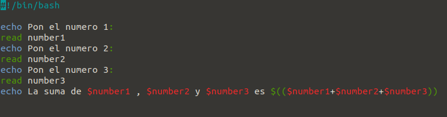
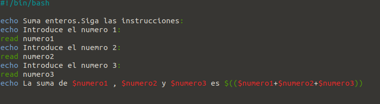

# Ejercicio 1

- Creams una carpeta:
```
mkdir ejercicio1
```
- Inicializa un repositorio git en la carpeta creada:
```
cd ejercicio1
git init
```
- Creamos el script:
```
nano script.sh
```
- Le ponemos el interprete y la suma de esta forma:



- Para que el script se pueda ejecutar ponemos:
```
chmod +x script.sh
```

- Ralizamos la operacion y miramos si funciona poniendo:
```
./script.sh
```

- Lo añadimos al seguimiento:
```
git add script.sh
```

- Saldrá la suma correctamente y tendremos que realizar un commit para que se guarden los cambios de esta forma:
```
git commit -am "primer commit"
```

- Se nos pide que modiquemos la operracion y que pongamos un tercer numero. Deberemos crear una nueva rama para hacerlo:
```
git branch rama1 // Para crearla
git checkout rama1 //Para entrar en ella
```

- Y ahora volvemos a entrar al script de la forma anterior(nano script.sh) y ponemos otra linea como sale en la imagen:



- Volver a la rama master:
```
git checkout master
```
- Actualizar la rama master:
```
git merge rama1
```
- Saldrá la suma correctamente y tendremos que realizar un commit para que se guarden los cambios de esta forma:
```
git commit -am "suma de 3 números"
```

- Ahora nos piden que modifiquemos el script original para que muestre un mensaje previo. Primero deberemos crear una nueva rama:
```
git branch rama2 // Para crearla
git checkout rama2 //Para entrar en ella
```
- Ahora volvemos a entrar al script yponemos esto:



- Ahora lo guardamos así:
```
git commit -am "mensaje previo"
```

- Regresa a la rama master.
```
git checkout master
```

- Integra (y después borra) la segunda rama (rama2) en la rama master (merge)
```
git merge rama2
git branch -d rama2
```

- Integra (y después borra) la segunda rama (rama1) en la rama master (merge)
```
git merge rama1
git branch -d rama1
```

- Resuelve los conflictos usando meld (git mergetool)
```
git mergetool
sudo apt install meld
```

- Guarda la resolución del conflicto en el repositorio local (commit)
```
git commit -am "mergetool"
```

- Ejecuta el script y comprueba que funciona correctamente
```
./script.sh
```

- Muestra el log del repositorio (git log)
```
git log
```


